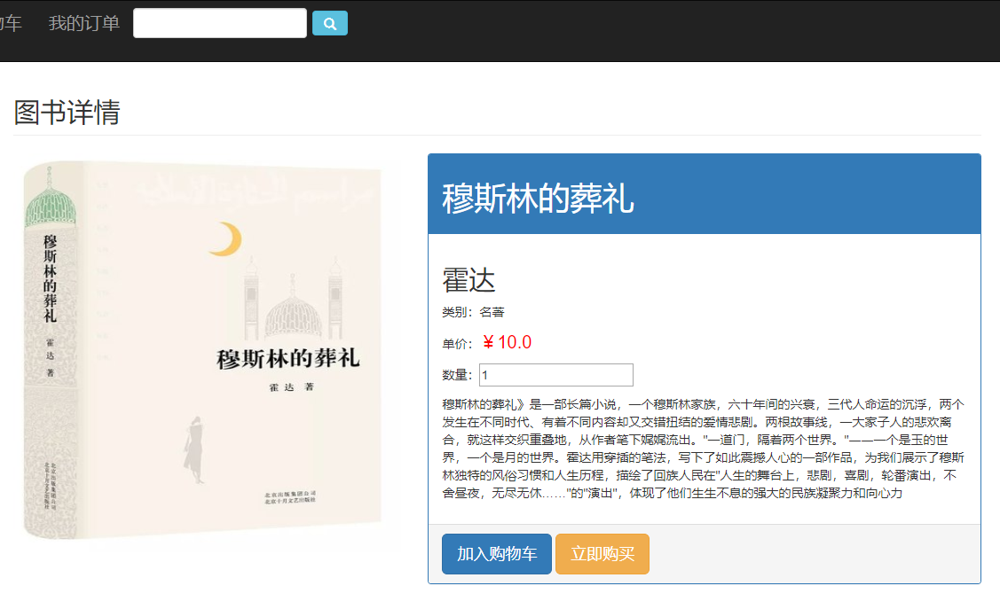
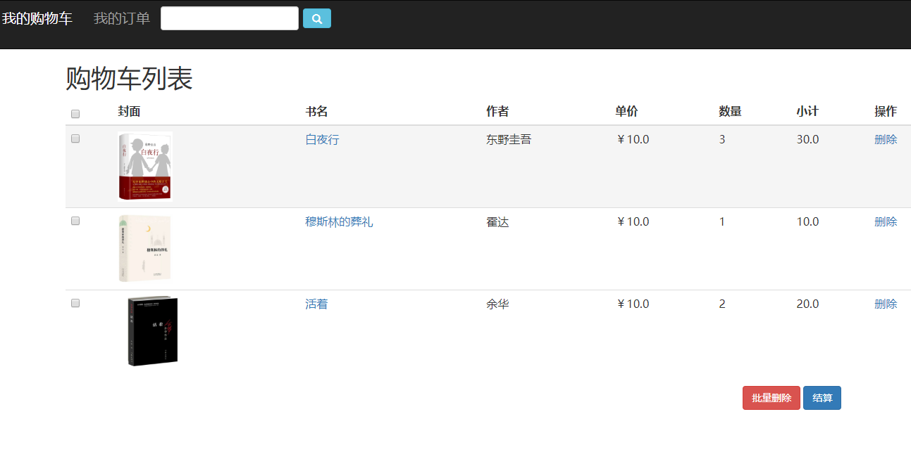
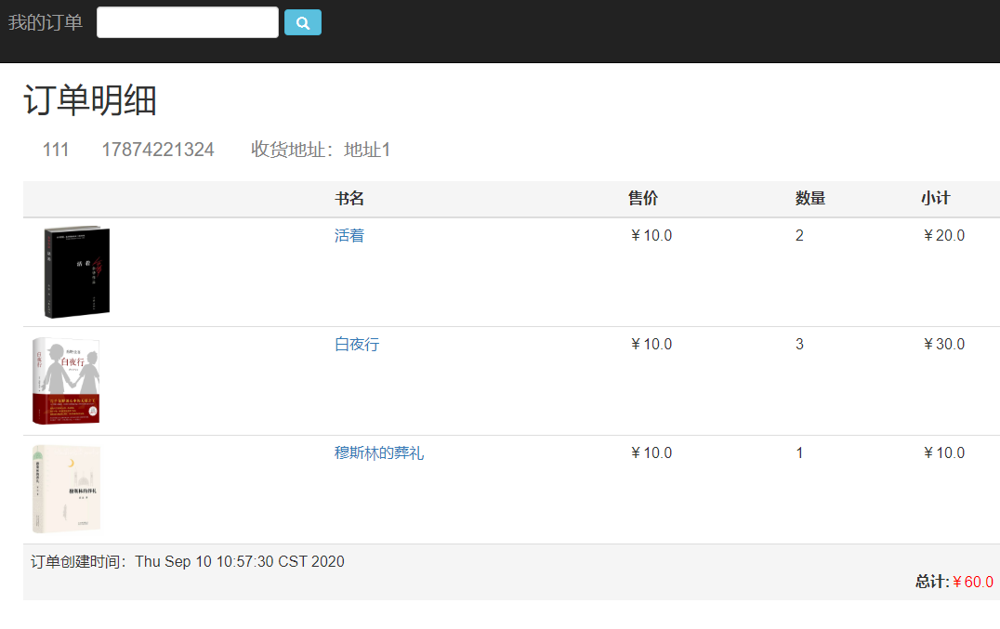
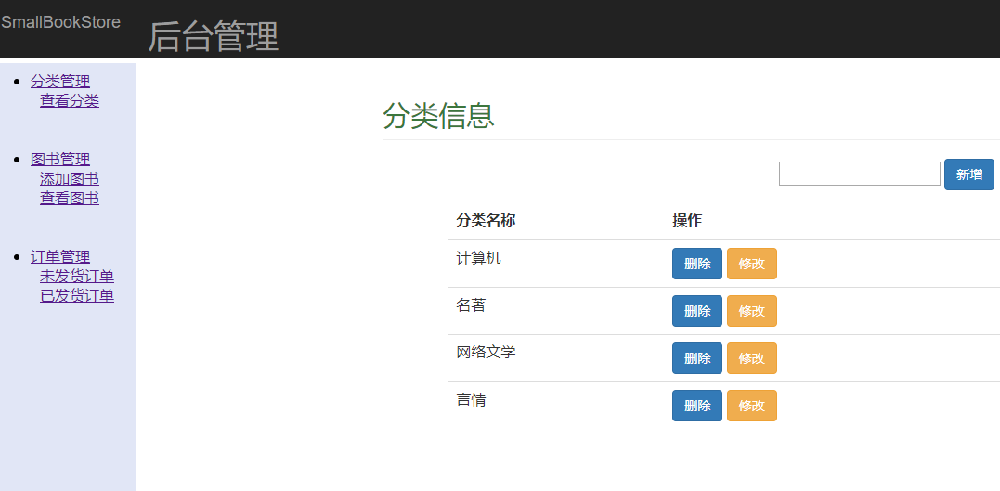
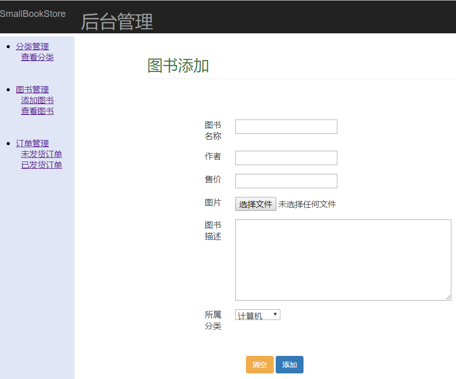
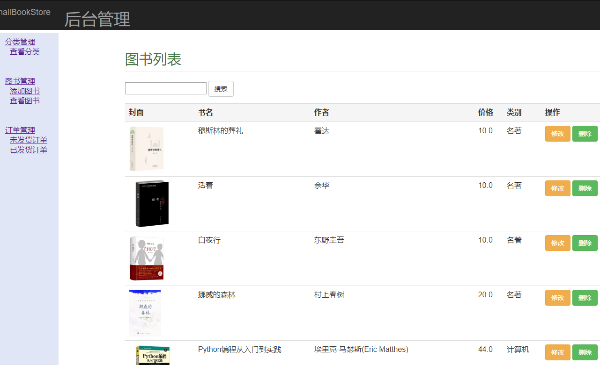
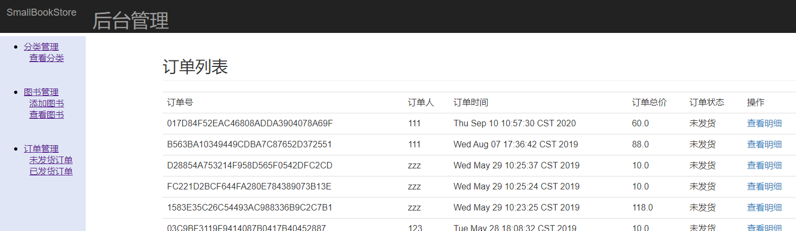

# BookStore (bookstore-bootstrap-mypage)
基于springboot+mybatis的网上书店。购物车通过session解决。无具体订单交付过程。不可修改订单用户信息。

## 功能展示
### 1. 前台
##### 1.1 登录

#### 1.2 首页

#### 1.3 图书详情

#### 1.4 购物车

#### 1.5 个人订单

#### 1.6 订单详情
电话和地址均默认注册时提交 

## 2. 后台
没有设置登录，为了简单直接输入manager/index.jsp进入 
#### 2.1 分类管理

#### 2.2 图书管理
添加图书 

查看图书

#### 2.3 订单管理

